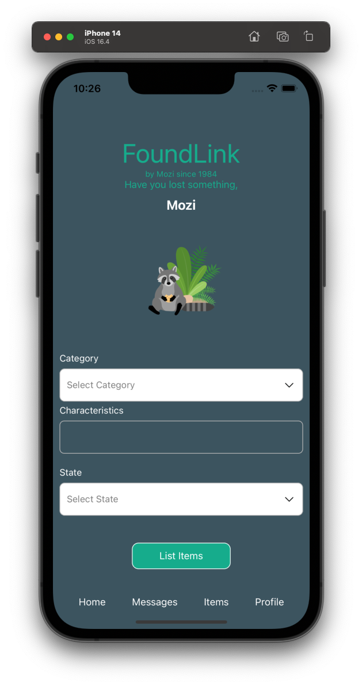

# FoundLink - Lost and Found App

## Introduction

Introducing "FoundLink" - the ultimate lost and found app that brings people together with their cherished belongings effortlessly, without any unnecessary hurdles. Say goodbye to bureaucracy and welcome a hassle-free experience that's as simple as a click.
FoundLink offers a seamless platform to connect with others who have found your lost items, instantly reuniting you with what you hold dear.
With FoundLink, the process is a breeze. Whether you misplaced your keys, left your favourite jacket behind, or even lost a beloved keepsake, our app streamlines the entire journey. No more waiting in long queues or enduring tedious paperwork. Just snap a photo, enter a brief description, and voila! Your item is listed and ready for discovery.
We prioritize your security and peace of mind. FoundLink ensures a secure environment where your personal information remains confidential.
Our advanced verification system guarantees trustworthy interactions, allowing you to connect with fellow users who genuinely want to help you find what's lost.
But that's not all! FoundLink is an app on demand, available at your fingertips whenever needed. Our user-friendly interface ensures effortless navigation and quick results, whether at home, in the office, or on the go. Browse through the database of found items, receive real-time notifications, and directly communicate with finders to swiftly reclaim what's rightfully yours.
So, why wait? Experience the joy of rediscovery with FoundLink. It's the epitome of simplicity, security, and immediate connection.
Our app makes the journey from lost to found an exhilarating adventure filled with smiles, gratitude, and the restoration of precious memories.

## Description

FoundLink is a Smartphone Application written in React Native and Expo which allows users to connect with others who have found your lost items. The User can store favorite Items as well as add and delete profile information.
The Application uses React Native and Expo in the Frontend and Next.js with PostgreSQL in the Backend.

## Demo Video

https://github.com/tattoomozi/lost-and-found-final

## Features Frontend

User Registration, Login, Logout
Validation of API requests with Session Token and a CSRF-Token
Add and Delete Profile Information (Name, Street, House Number, Postal Code, City, Email)
Add favorite items which you carry all day every day to have a quicker access when lost ( Id, Category, Color, Description, State, Favorite Pickup Location )

## Features Backend

Session Management: Login, Logout and Revalidation routes
Authorization Checks
Add, Store and retrieve User Data
Tokens at all API Endpoints
Database migration setup with ley

## Future Updates

Google Maps API to show the location of the lost item or the pickup place
Push Notifications to inform the user when a new item is found
Add a picture of the lost / found item for a final validation at the agreed location
Full keyboard- and screenreader-accessibility

## Technologies

React Native
Expo / Expo Go / Expo CLI
Next.js
PostgreSQL
TypeScript
Figma for planning and
DrawSQL for Database Sketching

#### Index

[ProfileAlert](./expo-app/globals/MobileAppScreenshots/5_Profile_Alert.png)

